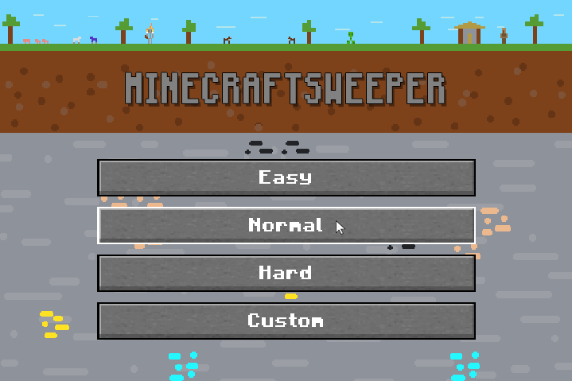
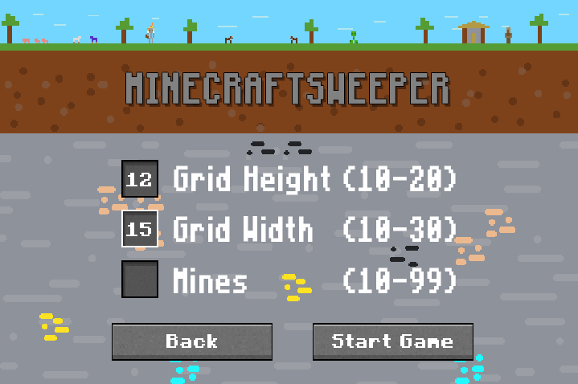
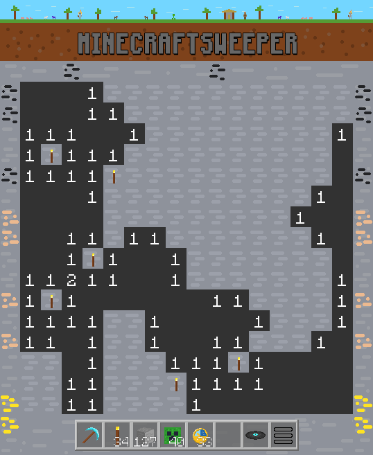
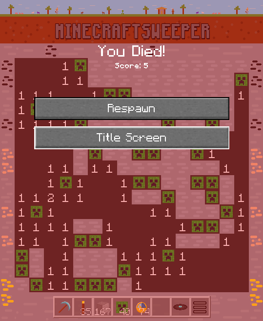
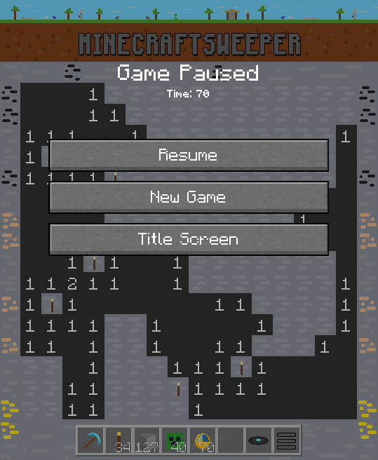

# Minecraftsweeper
A Minecraft themed version of the classic game Minesweeper. Written as an exercise for practicing inheritance, implementing abstract classes, basic game design, and idea execution (and a little graphic design!).

All the elements of Minesweeper have been reskinned with a Minecraft twist. Intead of tiles, you mine stone blocks. Mines/Bombs are now creepers, so instead of placing flags to prevent setting off mines, you place torches (to illuminate the cave, so to speak). Game information is now placed in your "Inventory". The number of flags remaining is the how many torches you have left. Time is kept by the how many clock item you have. The number of tiles destroyed is how many stone blocks you have. Additionally, you can toggle music (when implemented) by clicking the music disc, and the pause menu can also be accessed through the inventory.

## Installation
`pip install pygame`

## Features
### Game Mechanics
 - Minesweeper, but with a Minecraft theme.
 - All buttons are animated with selection highlighting.
 - Three pre-set game modes and an additional custom game setup.
 - Interactive input boxes for custom game menu. Boxes can be iterated through via up/down arrow and tab.
 - Game state information displayed in "inventory".
 - Pause menu can be accessed through esc or inventory slot.
 - Animation for loss screen to replicate original minesweeper.
 - Original music score and custom sound effects.
 ### Code
 - A single game loop for the program.
 - All scenes inherit from an abstract scene class.
 - Abstract scene class implements render stack so that the game can render menus/transitions in an accessible hierarchy
 - Minesweeper game mechanics are in separate class and fully encapsulated such that it could be used for any minesweeper theme/skin. 

 ## Screenshots
 
 
 
 
 

 ## Acknowledgments
 Thanks to [pygame](https://www.pygame.org/) authors and contributors.
